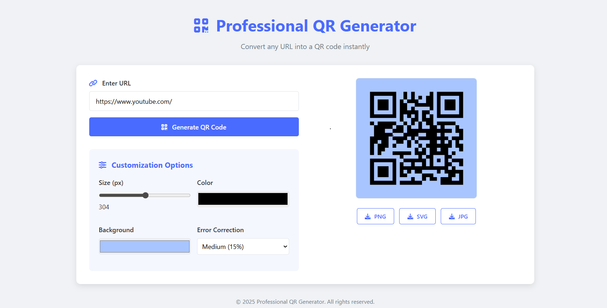

# 🎨 QR Code Maker Web App  

🚀 **[👉 Live Demo – Try it Now](https://qr-profession.netlify.com)**  

A **professional and customizable QR Code Generator** built with **HTML, CSS, and JavaScript**.  
Users can generate QR codes instantly and customize them with **different sizes, colors, and styles**.  

---


## 🚀 Features  
- ✅ Generate QR codes instantly from text or URLs.  
- 🎨 Customize **QR Code color** (foreground/background).  
- 📏 Change **QR Code size**.  
- 💾 Download QR Code as an image (PNG).  
- 📱 Responsive and easy-to-use interface.  
- ⚡ Works offline (no backend required).  

---

## 🛠️ Tech Stack  
- **HTML5** – Structure  
- **CSS3** – Styling & Responsive Design  
- **JavaScript (Vanilla JS)** – QR generation + customization  

---

## 📂 Project Structure  
```

qr-code-maker-web-app/
│── index.html      # Main HTML page
│── styles.css      # Styling (UI/UX design)
│── script.js       # QR code generation & customization logic
│── README.md       # Project documentation

```

---

## ⚡ How It Works  
1. Enter your text or URL in the input field.  
2. Choose customization options:  
   - QR size (e.g., 150px, 200px, 300px).  
   - Foreground & background color.  
3. Click **Generate QR Code**.  
4. Download and share your QR Code anywhere.  

---

## 🌐 Live Demo  
👉 **[Check it here](https://maker-qr.netlify.app/)**  

---

## 📸 Screenshots  


<p align = "center">
    
</p>


---

## 🔧 Installation & Usage  
1. Clone this repository:  
   ```bash
   git clone https://github.com/Bala9840/qr-code-maker-web-app.git
2. Navigate to thhe project folder:  
   ```bash
   cd qr-code-maker-web-app\
3. Open:  
   ```bash
   index.html in your browser

---

## 📌 Future Enhancements

* Add **QR Code with Logo/Image in center**.
* Support **SVG/PDF download format**.
* Direct **share to WhatsApp, Email, LinkedIn**.
* Save customization preferences for users.

---

## 🤝 Contributing

Pull requests are welcome! For major changes, please open an issue first to discuss your idea.

---

## 📜 License

This project is licensed under the **MIT License** – you can freely use and modify it.

---

👨‍💻 Developed by **[Bala9840](https://github.com/Bala9840)**

